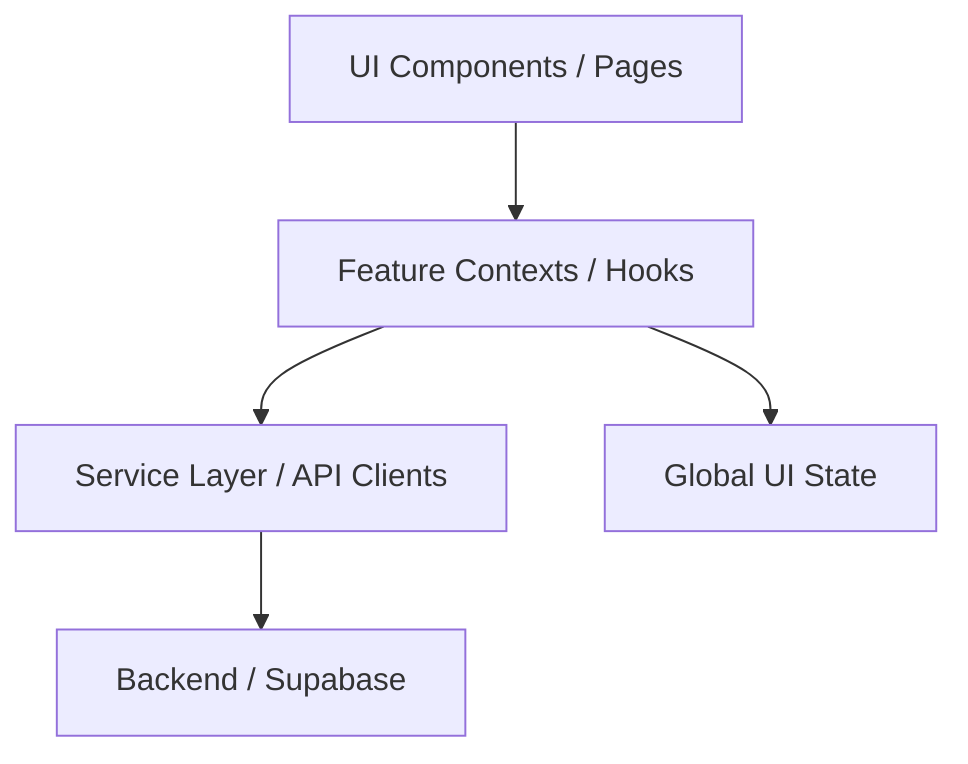

# Architecture V1

Dokumen ini menjelaskan arsitektur perangkat lunak untuk aplikasi MoneyTracking V1.

## High-Level Overview
Aplikasi ini dibangun menggunakan arsitektur komponen React modern dengan TypeScript, bertujuan untuk memisahkan UI (View) dari Logika Bisnis (State/Services), sehingga mudah dipelihara dan di-scale.



## Struktur Folder

```text
src/
├── assets/         # Static assets (images, icons)
├── components/     # UI Components yang re-usable
│   ├── ui/         # Primitives (Button, Card, Input, Modal)
│   ├── finance/    # Domain-specific UI (TransactionItem, StatCard)
│   └── layout/     # AppShell, Navigation, Sidebar
├── features/       # Business logic dikelompokkan per fitur
│   ├── auth/       # AuthContext, login logic
│   └── workspace/  # WorkspaceContext, logika switch Pribadi/Bisnis
├── lib/            # Utilities, Type definitions, dan Helper
│   ├── types.ts    # Global TypeScript interfaces
│   ├── utils.ts    # Helper (formatCurrency, date format)
│   └── mock-data.ts# Dummy data sebelum integrasi Supabase
└── pages/          # Halaman utama aplikasi (Routed components)
```

## Prinsip Desain Arsitektur (Separation of Concerns)

### 1. UI Components (`components/ui/`)
Komponen murni (dumb components). Hanya menerima `props` dan merender UI. **Tidak boleh** memanggil API langsung atau mengakses Context secara diam-diam.
*Contoh:* `<Button onClick={...}>Submit</Button>`

### 2. Feature Components (`components/finance/`)
Komponen yang spesifik untuk domain finance, tapi tetap sebisa mungkin menerima data lewat props.
*Contoh:* `<TransactionItem transaction={txData} />`

### 3. Pages (`pages/`)
Komponen yang bertanggung jawab untuk mengambil data (via Context/Hooks) dan menyebarkannya ke komponen UI di bawahnya.
*Contoh:* `DashboardPage` mengambil data transaksi dari `useTransactions()` lalu merender `TransactionList`.

### 4. State Management (`features/`)
Karena aplikasi ini belum kompleks, kita menggunakan **React Context** untuk state global:
- `AuthContext`: Menyimpan info user login.
- `WorkspaceContext`: Menyimpan workspace aktif (Pribadi / Bisnis).
*Note: Jika aplikasi semakin besar, bisa migrasi ke Zustand atau Redux.*

## Mengapa Tidak Pakai Struktur Lama?
Project lama menggabungkan UI dan logic dalam `script.js`.
Jika ingin menambah field pada transaksi:
- Di versi lama: Harus edit string HTML dalam JS, lalu edit logika parsing, lalu update DOM manual.
- Di V1: Cukup update `types.ts`, sesuaikan form di `AddTransactionPage`, dan logic penyimpanan di hook. Sisanya akan render ulang otomatis.
